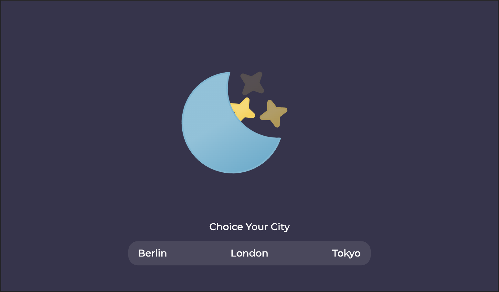
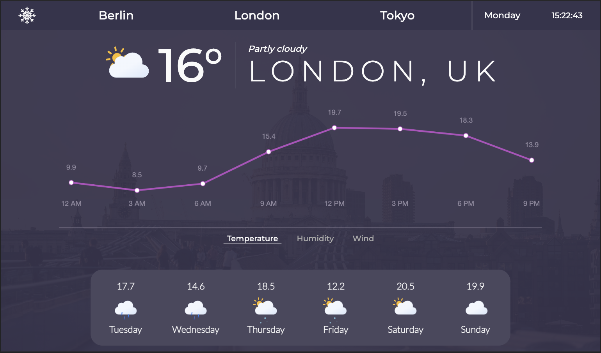
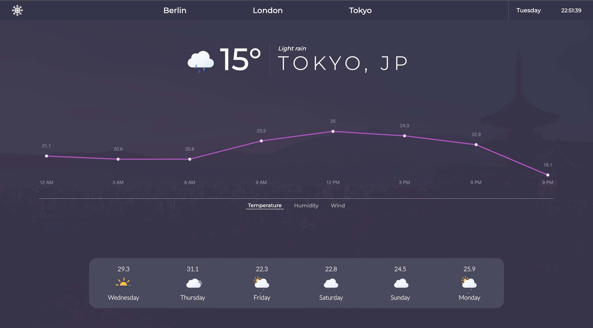

# Snowflake

Snowflake is a project created with Next.js and Vercel technologies that gives us information about the weather conditions of Berlin, Tokyo and London.





## Tech Stack
This project created with:
- ReactJS
- NextJS

## Run Locally

Clone the project

  

```bash

git clone https://github.com/bircankut/snowflake

```

  

Go to the project directory

  

```bash

cd snowflake

```

  

Install dependencies

  

```bash

yarn install

```

  

Start the server

  

```bash

yarn dev

```

## Environment Variables

  

To run this project, you will need to add the following environment variables to your .env.local file

`NEXT_PUBLIC_WEATHER_API_KEY`='your enviroment variable goes here'

## Authors
- [@bircankut](https://www.github.com/bircankut)

## Acknowledgements
- [This project's design] (https://dribbble.com/shots/3987420-Weathly-Weather-App-UI)

## API Reference

  

#### Get current week's weather

  

```http

GET /api/history

```

  

| Parameter | Type       | Description                  |
| :-------- | :--------- | :-------------------------   |
|    `q`    |  `city`    |  **Required**. Selected city |
|   `dt`    |  `string`    |  **Required**. First date    |
| `end_dt`  |  `string`    | **Required**. Last date      |

  

#### Get current day's weather

  

```http

GET /api/current

```

  

| Parameter | Type | Description |
| :-------- | :------- | :-------------------------------- |
|  `q`      |  `city`  |  **Required**. Selected city      | 

## Deploy on Vercel

The easiest way to deploy your Next.js app is to use the [Vercel Platform](https://vercel.com/new?utm_medium=default-template&filter=next.js&utm_source=create-next-app&utm_campaign=create-next-app-readme) from the creators of Next.js.

Check out our [Next.js deployment documentation](https://nextjs.org/docs/deployment) for more details.
